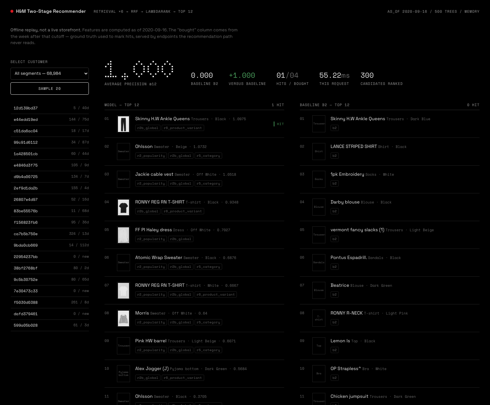

# Two-Stage Fashion Recommendation System (H&M)

> Status: **complete through Phase 6** — data layer, evaluation, baselines, retrieval,
> ranking, error analysis, serving, and the offline/online parity test. Not deployed to a
> public URL yet. Nothing is reported here that has not been measured.

Predict the 12 articles a customer will buy in the next 7 days, from 31M H&M transactions.
Retrieval narrows ~105K articles to 300 candidates per customer; a LambdaRank model orders
them. Scored with MAP@12, the same metric as the Kaggle competition, so results can be
calibrated against a public leaderboard.

## Demo

**Live: https://hm-recsys-vpllq7symq-an.a.run.app** — scale-to-zero, so the first request
after an idle period takes a few seconds.



The console is an offline replay, not a live service: features are computed as of 2020-09-16 and
the "actually bought" column is the week after that cutoff. It exists to show the things a
shopping UI cannot — whether each prediction was right, which retrieval strategy proposed it,
and what the same customer's baseline prediction looked like.

```bash
make setup && make download && make data   # once
make train && make serve-data              # model + serving snapshot
make serve                                 # console at http://localhost:8000/
```

Optional: `make images` downloads product photos for the tiles. They are used locally only —
`.dockerignore` and `.gitignore` both exclude them, because they are H&M's commercial
photography and the dataset licence does not cover redistributing them from a public URL. Without
them the tiles fall back to product type, which is what a deployed instance shows.

### Deploying

The image honours `$PORT`, so it runs unchanged on Cloud Run, Fly, or `docker run`:

```bash
docker build -t hm-recsys . && docker run -p 8000:8000 hm-recsys   # local
PROJECT_ID=my-project ./deploy/cloudrun.sh                         # Google Cloud Run
fly deploy                                                          # Fly.io (fly.toml present)
```

`HM_SERVE_MODE` picks how the snapshot is opened, and the right answer turned out to depend on
where it runs. Locally, `parquet` holds 834 MB instead of 3.1 GB and starts in 7 s instead of
55 s for 62% more median latency — clearly worth it. On Cloud Run the same mode costs 100% more
(294 ms versus 147 ms p50), because the container filesystem is a network-backed overlay rather
than local NVMe, so the deployment uses `memory` on a 4 GiB machine. Numbers for both are in
[reports/serving.md](reports/serving.md).

Deployment is not wired into CI. The workflow in
[.github/workflows/ci.yml](.github/workflows/ci.yml) lints, runs the tests, and builds the image
to prove the Dockerfile still resolves — but publishing a public URL that serves Kaggle-derived
data is a decision a person makes, not something a merge triggers.

## Task

| | |
|---|---|
| Input | all customer behaviour strictly before day T |
| Output | 12 ranked article ids for [T, T+7) |
| Primary metric | MAP@12 |
| Retrieval metric | recall@100 |
| Ranking metric | NDCG@12 |

### Comparability with the Kaggle leaderboard

The metric here is the competition's own: MAP@12, averaged over customers **who purchased
during the target week**, with customers who bought nothing dropped from the average rather
than scored as zero. That is how the competition's evaluation works, so the numbers in this
README are on the same scale as the public leaderboard — not a rescaled proxy.

One difference does remain and cannot be removed: the competition's test week
(2020-09-23 onward) is not in the public dataset, so validation here uses the last week that
is (2020-09-16 to 2020-09-23). Same metric, same population definition, different week.

### Why we score buyers only

MAP@12 is averaged over customers. In the validation week only 68,984 of 1,362,281 customers
bought anything — 5.1%. Scoring everyone would multiply every score by ~0.05 and compress the
gap between a good model and a bad one into the fourth decimal. Evaluation is therefore
restricted to customers with at least one purchase in the target week
([src/eval/split.py](src/eval/split.py)). Those customers bought 3.1 distinct articles on
average, so the practical ceiling on MAP@12 is set by a handful of items, not by 12.

## Time split

```
|<----- feature window (90d) ----->|<-- train week -->|<-- val week -->|
                                   2020-09-09         2020-09-16    2020-09-23
```

Random splitting is invalid here for two reasons. First, it leaks the future: an item's
popularity next week is the single strongest predictor of purchases, and a random split lets
the model read it. Second, it misstates the deployment condition — at serving time only the
past exists, so any offline estimate produced by a random split is measuring a task nobody
will ever run.

The rule that enforces this: **every feature function takes an `as_of_date` and may only read
`t_dat < as_of_date`.** One convention buys three things — no leakage, one code path shared by
training/validation/serving, and a mechanical test for both
([tests/test_no_leakage.py](tests/test_no_leakage.py), [tests/test_parity.py](tests/test_parity.py)).

Dates live in [src/config.py](src/config.py) and are hardcoded nowhere else.

## Data layout

CSVs are converted once to Parquet with compressed types
([src/data/ingest.py](src/data/ingest.py)):

| column | raw | stored | reason |
|---|---|---|---|
| `customer_id` | 64-char hex string | `int64` key (+ side mapping table) | 137M chars -> 11MB |
| `article_id` | int64 | `int32` | max ~9.6e8 |
| `price` | float64 | `float32` | 5 significant digits is plenty |
| `t_dat` | varchar | `DATE` | partition key |

Transactions are Hive-partitioned by `t_year`/`t_month`. Daily partitions were rejected: 734
partitions of ~43K rows each sit far below one Parquet row group and make every scan slower,
while month partitions still prune correctly for the time split.

Measured: 3.5 GB of CSV becomes 308 MB of ZSTD Parquet, and the full conversion of 31,788,324
transactions runs in 5.5 s on a laptop. `verify()` asserts at ingest time that the customer
key mapping is bijective over all 1,371,980 ids — a silent hash collision would merge two
customers' histories and corrupt every downstream number.

| | |
|---|---|
| transactions | 31,788,324 rows, 2018-09-20 to 2020-09-22 |
| customers | 1,362,281 with >=1 transaction (1,371,980 in `customers.csv`) |
| articles | 104,547 |

All aggregation is SQL on DuckDB ([sql/features/](sql/features/)); pandas is only used at the
model boundary.

## Baseline ladder

Validation week 2020-09-16 to 2020-09-23, 68,984 customers, all features cut off strictly
before 2020-09-16. `coverage` is the share of evaluated customers a baseline returns anything
for. Reproduce with `python -m src.baselines.run`.

| baseline | MAP@12 | recall@12 | coverage |
|---|---|---|---|
| B0 bestsellers, last 7d | 0.00875 | 0.02550 | 1.000 |
| B1 repurchase, last 90d | 0.02211 | 0.03647 | 0.732 |
| **B2 repurchase + bestseller fill** | **0.02557** | 0.05201 | 1.000 |
| B3 ALS (128 factors, 365d) | 0.00942 | 0.02324 | 0.889 |
| B3b ALS + bestseller fill | 0.01030 | 0.02610 | 1.000 |
| **Two-stage (retrieval + LambdaRank)** | **0.03354** | **0.07112** | 1.000 |

**The two-stage model beats B2 by 31.2%.**

Three things worth reading off this table:

**B2 is the real opponent, and it is strong.** Repurchase alone triples global popularity.
Padding it to 12 slots adds another 16% and takes coverage to 1.0, because 27% of these
customers have no purchase in the trailing 90 days and B1 cannot serve them at all. Any
retrieval+ranking stack that does not clearly beat 0.02557 has demonstrated nothing.

**ALS loses to a popularity list.** Not a tuning artefact: a sweep over factors
(64/128/256), alpha (1/40), lookback (180d/365d) and regularisation spans MAP@12 0.0065 to
0.0094 — the whole plausible range sits an order of magnitude below B2. Plain matrix
factorisation optimises for items similar to a customer's entire history, while a given week's
purchases are dominated by very recent stock. What the sweep also showed is that ALS's
recommendations overlap the customer's own recent purchases only ~9% of the time, so it
proposes genuinely different items. That makes it a retrieval source, not a ranker — which is
the argument for a two-stage architecture in one number.

**recall@12 is roughly double MAP@12 across the board**, so ordering — not candidate
availability — is where the ranking stage has room to work.

## Retrieval

Six strategies, evaluated individually and by leave-one-out ablation on the union
([reports/recall.md](reports/recall.md), reproduce with `python -m src.recall.run`).

| strategy | recall@300 | coverage | union drop if removed |
|---|---|---|---|
| R2b global bestsellers (top 400, 7d) | 0.23119 | 1.000 | **−0.0206** |
| R2 bestsellers within age bucket | 0.19376 | 1.000 | −0.0190 |
| R6 product variant (same `product_code`) | 0.06396 | 0.731 | −0.0020 |
| R4 ALS | 0.04885 | 0.889 | −0.0013 |
| R5 category bestsellers | 0.04492 | 0.732 | −0.0008 |
| R1 exact repurchase | 0.03821 | 0.732 | −0.0001 |
| R3 item-kNN (co-purchase) | 0.06606 | 0.730 | **+0.0029** |
| **union** | **0.27372** | 1.000 | |

Three findings changed the design:

**Exact repurchase is only 2.8% of validation-week purchases.** B1 scores well because those
few predictions are extremely precise, not because repurchase is common. The intuition that
"fashion is repurchase-driven" is true for precision and false for reach — and only the
ablation shows which.

**`product_code` is where the repurchase signal actually lives.** The first 7 digits of
`article_id` identify the garment; colour and size variants get different `article_id`s. A
customer rebuying the same shirt in another colour is invisible to R1. Adding R6 to exploit
this produced the single strongest feature in the ranker (see below).

**Depth beats personalisation at the candidate stage.** Global top-500 alone reaches recall
0.313, higher than the entire personalised strategy set's ceiling of 0.272. 93.7% of
validation-week purchases are of articles inside the trailing-7-day top-20000, so candidate
generation is a reach problem. Personalisation still adds — the full union at a 500 budget
reaches 0.332 versus 0.284 for popularity alone — but it earns its keep in the ranker.

### Generators vs annotators

R3 item-kNN has respectable standalone recall yet *lowers* union recall: at a fixed budget its
candidates displace better ones. Deleting it would also throw away a real similarity signal, so
strategies are split by measured role ([src/recall/pipeline.py](src/recall/pipeline.py)):
generators contribute candidates, annotators contribute only features joined onto candidates
someone else proposed. R3 is an annotator.

### Candidate budget — and why recall stopped mattering

| budget | 12 | 50 | 100 | 200 | 300 | 500 |
|---|---|---|---|---|---|---|
| union recall | 0.051 | 0.117 | 0.167 | 0.227 | **0.274** | 0.336 |

The obvious read is that retrieval is the bottleneck: at 300 candidates, 73% of what customers
actually bought never enters the candidate set. Measuring end to end says otherwise
([reports/rolling.md](reports/rolling.md)):

| budget | recall | MAP@12 |
|---|---|---|
| 100 | 0.16175 | 0.03250 |
| 300 | 0.27324 | 0.03260 |
| 500 | 0.32722 | **0.03259** |

**Doubling recall changes MAP@12 by nothing.** The additional ground-truth items the retrieval
layer reaches at 500 candidates are ones the ranker cannot lift into a top-12 slot, so they
never reach the metric. Retrieval is not the binding constraint; ranking is.

This inverted the improvement plan. "Recall@300 is only 0.27, so improve retrieval" is the
intuitive conclusion and it is wrong — more retrieval work would have bought zero MAP. The
budget stays at 300 because latency is flat in it (see serving) and it leaves headroom for a
stronger ranker to exploit later, not because it currently pays.

The general lesson, and the reason the two-stage split needs measuring rather than assuming:
a stage-level metric is only worth optimising to the extent the *next* stage can act on it.

## Ranking

LightGBM `LGBMRanker` with `lambdarank`, 500 trees, 63 leaves, trained on the five weeks
ending 2020-09-09 and validated on 2020-09-16. 63 features. Reproduce with `python -m src.rank.train`.

Training samples: candidates generated with `as_of = 2020-09-09` (never from full history),
labelled by what the customer bought that week, negatives downsampled to 20:1 within customer.
**Validation is never downsampled** — 68,984 customers x 300 candidates, scored in chunks —
because MAP@12 over a thinned candidate set measures a task that does not exist in production.
Customers with no positive candidate are dropped from training only: a group with no relevant
item contributes nothing to a LambdaRank gradient.

Result: 5,620,587 training rows, 267,647 positives (4.76%), **MAP@12 0.03354** against B2's
0.02557.

### Top features by gain

| feature | gain |
|---|---|
| `score_r6_product_variant` | 114,645 |
| `days_since_last` | 39,228 |
| `ca_days_since_last` | 37,620 |
| `rank_r6_product_variant` | 34,114 |
| `rrf_score` | 26,283 |
| `n_sold_1d` | 24,703 |
| `age` | 22,910 |

The two R6 columns together carry more gain than the next five features combined. Retrieval
signals — each strategy's rank and score, plus the fused RRF score and how many strategies
agreed — are among the strongest inputs, which is why retrieval output is kept in long format
with per-source ranks rather than collapsed to a bare candidate set.

## Repository

```
src/config.py            dates, paths, constants — the only place a date is written
src/data/ingest.py       CSV -> Parquet
src/data/db.py           DuckDB connection + views
src/eval/metrics.py      MAP@12, recall@k, NDCG@k
src/eval/split.py        ground truth for a target week
src/features/builder.py  the single feature builder, shared by offline and online
src/recall/strategies.py R1-R6
src/recall/pipeline.py   RRF fusion, generator/annotator split, candidate assembly
src/rank/dataset.py      labelling, negative downsampling, group construction
src/rank/train.py        LightGBM LambdaRank
src/baselines/           B0-B3
src/serve/               FastAPI + FAISS (not built yet)
sql/features/            feature SQL, all parameterised by as_of_date
tests/test_no_leakage.py builds features against full vs truncated history, asserts equality
```

## Running

Every number in this README is reproducible; `reports/resume.md` maps each claim to its command.

```bash
make setup      # venv + dependencies
make download   # Kaggle CSVs (needs ~/.kaggle/kaggle.json; images are not downloaded)
make data       # CSV -> Parquet         (5.5 s)
make baselines  # B0-B3                  (~5 min, ALS dominates)
make recall     # retrieval ablation     (~6 min)
make train      # ranker + validation    (~6 min)
make test
```

## What we tried, and why we stopped

Week-to-week variation in MAP@12 is roughly 6% (2020-09-02 scores 0.0306, 2020-09-16 scores
0.0326 for the same model), so that is the threshold an improvement has to clear to mean
anything. Establishing it first is what made the rest of this table interpretable.

| intervention | magnitude of the change | ΔMAP@12 | significant? |
|---|---|---|---|
| candidate budget 100 -> 500 | retrieval recall 0.162 -> 0.327 | −0.0% | no |
| training weeks 1 -> 5 | 1.1M -> 5.6M rows | +2.5% | no |
| negatives per positive 20 -> 100 | group size 21 -> 101, 11.4M rows | −0.9% | no |
| feature set 55 -> 63 | product-code affinity, last-purchase kNN, price fit | +1.2% | no |
| **all combined (final model)** | | **+2.9%** | **no** |

Four controlled experiments, none clearing the noise floor. The system plateaus near 0.0335,
and the win that matters — beating B2 by ~30% — was already present in the first version.

What each null result rules out is the useful part:

- **Retrieval is not the constraint.** Doubling recall changed nothing, so the extra
  ground-truth items reached at 500 candidates are ones the ranker cannot lift into a top-12
  slot. Further retrieval work would have returned zero.
- **Data volume is not the constraint** — but it *was* fixing something else. The in-sample /
  out-of-sample gap collapsed from +54.8% to +17.8% (1 week: 0.0481 vs 0.0311; 5 weeks: 0.0382
  vs 0.0325). The single-week model was overfitting badly; more weeks fixed that without
  raising the score. Both numbers were needed to conclude "stop adding capacity, the model
  generalises fine and simply has nothing more to say."
- **Two of these interventions paid off somewhere other than MAP@12.** The gap narrowed again
  with the new features, to +9.2% ([reports/rolling.md](reports/rolling.md)). So the
  ranked-by-MAP verdict "feature engineering did nothing" is incomplete: it bought
  generalisation, not score. A single headline metric would have hidden that, which is the
  argument for reporting the in-sample gap alongside it.
- **The train/serve group-size mismatch is not the constraint.** Training groups hold ~21
  candidates while serving ranks 300, which looked like a real LambdaRank problem. Raising the
  ratio to 100 made it marginally *worse*. Worth noting this one was only correctly rejected
  because a matched 2-week control was run — comparing 2wk/ratio-100 against 5wk/ratio-20
  would have read as a win.
- **Feature information is the constraint, and it is stubborn.** `cpc_days_since_last` entered
  at #3 by gain, above the article-level equivalent, so the new features are heavily used —
  and still moved MAP by 1.2%. Being used is not the same as being informative.

For context, a published silver-medal solution to this competition scored 0.02996 on the
private leaderboard. This model sits above that on the same metric definition, on a different
week. Closing the remaining gap to the gold range (~0.036) is ensembling and image/text
embedding work — weeks of effort for maybe 10%, which is not where this project's remaining
time belongs.

## Error analysis

Full tables in [reports/error_analysis.md](reports/error_analysis.md)
(`python -m src.eval.analyze`). Three failure modes:

**1. Activity dominates everything — a 10x spread.**

| last purchase before cutoff | customers | model | B2 | lift |
|---|---|---|---|---|
| <=7 days | 12,670 | 0.10062 | 0.08367 | +20% |
| 8-30 days | 19,416 | 0.02738 | 0.02152 | +27% |
| 31-90 days | 18,431 | 0.01344 | 0.00774 | **+74%** |
| >90 days | 12,895 | 0.01059 | 0.00768 | +38% |
| never purchased | 5,572 | 0.01025 | 0.00788 | +30% |

The aggregate 0.03258 is carried by the 18% of customers who bought within the last week.
The model's largest *relative* gain, though, is on 31-90 day dormant customers — precisely
where the repurchase baseline has nothing recent to repeat.

**2. Anything outside the popularity head is invisible.**

| popularity decile | share of ground truth | hit rate |
|---|---|---|
| 10 (most popular) | 62.2% | 7.40% |
| 9 | 15.1% | 2.72% |
| 1-8 | 18.4% | <2.3% |
| 0 (never sold before cutoff) | 4.3% | **0.00%** |

Decile 0 is 9,279 purchases with a hit rate of exactly zero. An article with no interaction
history cannot be reached by any co-occurrence or popularity method, so this 4.3% is
structurally unreachable without image or text features.

**3. Narrow catalogue coverage.** 13,969 distinct articles recommended, 13.2% of the
catalogue; category entropy 1.85 bits against a 3.70-bit ceiling.

## Serving

```
GET /recommend/{customer_id}
  -> customer_key lookup
  -> retrieval from precomputed tables (repurchase, variants, popularity, category), RRF-fused
  -> feature assembly through the SAME assemble() the training pipeline uses
  -> LightGBM scoring -> top 12
```

The snapshot is built by `python -m src.serve.precompute`: 165 MB, 11 seconds, and it records
its own `as_of` in `meta.json`. None of its aggregations are re-implemented for serving — the
module calls the same strategy and feature functions the offline pipeline calls and persists
their output.

### Latency (in-process, 400 validation customers)

| candidate budget | p50 | p95 | p99 |
|---|---|---|---|
| 50 | 32.47 ms | 36.17 ms | 52.63 ms |
| 100 | 32.60 ms | 35.87 ms | 48.82 ms |
| 300 (default) | 34.41 ms | 36.91 ms | 39.05 ms |
| 500 | 35.56 ms | 38.26 ms | 44.73 ms |

Latency is almost flat in the candidate budget: 10x more candidates costs ~9% more time.
Scoring is not the bottleneck — fixed per-request work is.

An earlier version was flat at ~35 ms because `serving_sources` pulled the entire 42k-row
article feature table into pandas on every request. Passing table names into `assemble` instead
of materialised frames removed ~6 ms of p50, which is also why `FeatureSources` accepts either.

### Deployment, and the tradeoff that actually mattered

Containerised: 1.66 GB image (`python:3.12-slim`, 7 serving dependencies, the 320 MB snapshot,
the 3.4 MB model). Measured inside the container, 240 requests per mode:

| snapshot mode | resident memory | p50 | p95 | p99 |
|---|---|---|---|---|
| `memory` — tables materialised, customer_key indexes | 3.1 GiB | 39.1 ms | 49.7 ms | 96.0 ms |
| `parquet` — Parquet views, row-group pruning | **834 MiB** | 63.4 ms | 88.1 ms | **101.8 ms** |

**3.8x less memory for 1.6x the median, and p99 unchanged** — locally. On Cloud Run the same
comparison inverts (147 ms versus 294 ms p50 in favour of `memory`), which is covered in
[reports/serving.md](reports/serving.md) and is the clearest example in this project of a
laptop measurement being a hypothesis about production rather than a result. `category_candidates` is 22.8M
rows on its own, which is what made the in-memory copy expensive. Deployment uses `parquet`
(`HM_SERVE_MODE` in fly.toml): tail latency is what a user experiences and it did not move.

This is worth contrasting with the model-compression curve below, which is the tradeoff the
project originally set out to measure. Pruning trees bought 4% of p50 for 13% of MAP@12 — a bad
deal. Changing how the snapshot is opened bought a 74% memory reduction for 0% of MAP@12. The
lever that mattered was not in the model.

An earlier version of `fly.toml` requested 2 GB while the service actually needed 3.1 GB; the
container would have been OOM-killed on first boot. Measuring resident memory before deploying
is the only reason that was caught.

### Compression trade-off

Tree count truncated at predict time via `num_iteration`, MAP@12 recomputed on the same
customers:

| trees | % of full | MAP@12 | p50 | p99 |
|---|---|---|---|---|
| 500 | 100% | 0.02375 | 29.54 ms | 35.13 ms |
| 250 | 50% | 0.02230 | 28.84 ms | 38.80 ms |
| 100 | 20% | 0.02062 | 28.36 ms | 31.52 ms |
| 50 | 10% | 0.01956 | 28.70 ms | 33.42 ms |
| 25 | 5% | 0.01954 | 28.66 ms | 43.60 ms |

Cutting to 20% of the trees costs 13% of MAP@12 and buys 4% of p50 — a bad trade at this
scale, and the honest conclusion is that **model compression is not worth doing here**. The
model is 3.3 MB and inference is a small fraction of the request; the fixed cost of retrieval
and feature assembly dominates. Compression would matter if the ranker were 50x larger or the
candidate budget 10x higher.

### Offline/online agreement

Scored on the same 400 customers through both paths:

| | MAP@12 |
|---|---|
| offline pipeline | 0.02385 |
| online service | 0.02375 |
| top-12 overlap | 90.6% |

(These sit below the headline 0.03258 because this 400-customer sample is harder than average,
not because the serving path is worse — that is exactly what running both paths on the *same*
customers is for.)

The residual 9.4% disagreement is real and expected: the online snapshot omits the R3
annotator and R4 ALS, so those feature columns are filled with the same
"not retrieved" sentinel the offline pipeline uses.

## Training-serving skew

Offline reads a 31M-row transaction log; online reads a Parquet snapshot under a millisecond
budget. Those paths cannot share raw inputs, so
[src/features/builder.py](src/features/builder.py) separates the two things that skew
independently:

- `FeatureSources` — *where* the four feature blocks come from. Two implementations, by
  necessity: `offline_sources` aggregates the log, `serving_sources` points at the snapshot.
- `assemble` — *how* they become a feature row: joins, derived columns, null policy, column
  order, categorical dtypes. **Exactly one implementation, shared.**

Skew rarely comes from the aggregation. It comes from a join key, a `fillna`, or a column order
that drifted on one side only — and all of those now live in code neither path can bypass.
Absence encoding is part of this contract: `MISSING_RANK`/`MISSING_SCORE` are defined once and
used by both.

[tests/test_parity.py](tests/test_parity.py) builds the same candidate rows for the same
customers at the same `as_of` through both source implementations and asserts the assembled
rows are equal. A failure means the snapshot is stale, `precompute.py` and the offline pipeline
disagree on a window, or a new feature was added that the snapshot does not carry.

This was not theoretical. The first version of `precompute.py` re-implemented the R1/R6/
popularity SQL for serving — the exact duplication the design is meant to prevent. The
retrieval tables are now produced by calling `src.recall.strategies` and persisting the result.

## Known limitations

- **Exactly one clean validation week**, and it cannot be otherwise: 2020-09-16 is the last
  week in the dataset, so it is the only week the model can be scored on without having been
  fitted on later data. Scoring earlier weeks (see [reports/rolling.md](reports/rolling.md))
  gives +36% lift on 2020-09-02 and +84% on the in-sample training week, but neither is a
  valid generalisation estimate. Week-to-week variation is roughly 6%, so improvements smaller
  than that are noise.
- **ALS is off by default in the ranking pipeline.** Correctness requires fitting one ALS per
  cutoff (reusing a single model would let validation candidates come from factors that saw
  the validation week), which costs ~9 minutes for −0.0013 union recall. Enable with
  `--with-als`.
- **No image or text features.** The 35 GB image set is deliberately not downloaded, and
  `detail_desc` is unused. Error analysis puts a number on what that costs: articles that had
  never sold before the cutoff are 4.3% of ground truth and are hit 0.00% of the time. Nothing
  built from co-occurrence or popularity can reach them, so this is the one remaining lever the
  four experiments above did not exhaust. Text is the cheaper half — `detail_desc` is already
  in `articles.parquet` (99.6% populated, ~142 characters) and needs no download at all.
- **The console shows product names, not photos.** Images would make the demo legible to a
  non-technical viewer, and the front end already has a slot for them that degrades to
  product-type tiles. Displaying images is independent of using them as model features.
- **Retrieval recall is not the binding constraint — the ranker is.** See below; this was the
  most useful negative result in the project and it inverted the obvious improvement plan.
